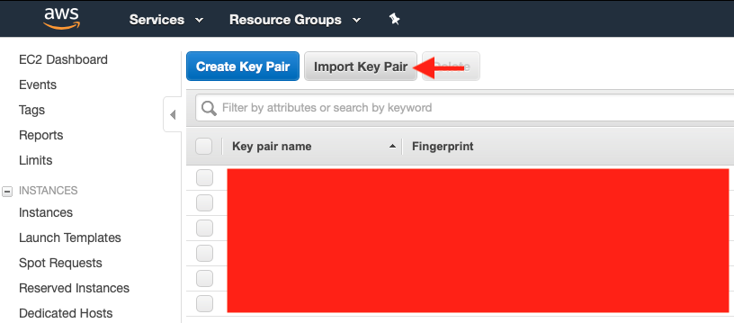
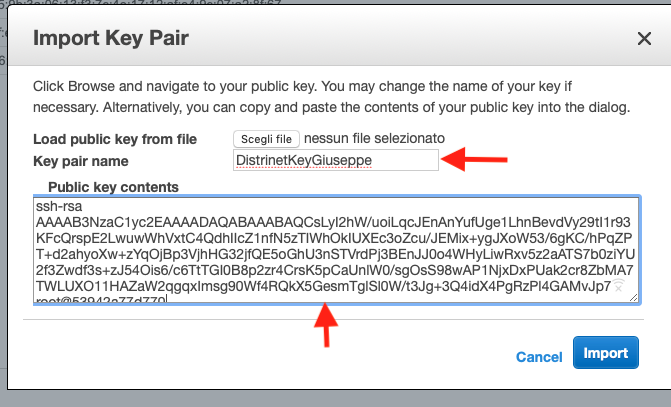

## Table of contents
{: .no_toc .text-delta }

1. TOC
{:toc}

# Prerequisites

In order to successfully install and run Distrinet on Amazon EC2, ensure your system meets the requirements described in this section.
Distrinet is compatible with python 3.6 or grater versions.

You need:
* to have distrinet installed in your machine (or via docker), if not please follow these [instructions](https://distrinet-emu.github.io/installation.html)
* an Amazon AWS account [link](https://aws.amazon.com/)
* a text editor, in this case we use vim

# AWS Configuration
You need to put your AWS Credentials in ~/.aws/credentials.
You can create your aws_access_key_id and aws_secret_access_key from the [AWS Web interface](https://aws.amazon.com/)
```
mkdir ~/.aws
vim ~/.aws/credentials
```

File ~/.aws/credentials:
```
[default]
aws_access_key_id=XXXXXXXXXXXXXXXXX
aws_secret_access_key=YYYYYYYYYYYYYYYYYYYYYY
```

## Create aws_access_key_id and aws_secret_access_key via [AWS Web interface](https://aws.amazon.com/):

* Go to https://aws.amazon.com/ and log in


* Click on your username and go to "My security Credentials"


* On the left pannel click on "Users" and then click on your User(be sure that it has the right permissions)


* On Summary pannel Click on "Create access Key"


* Congratulation, you have a new Access Key ID and a Secret access key 


* you need to import you ssh public key in AWS

if you dont have a private and public key created in your system you can generate it with:
```
ssh-keygen
```

for this version you need to leave the default values like here:
```bat
root@53942a77d770:# ssh-keygen
Generating public/private rsa key pair.
Enter file in which to save the key (/root/.ssh/id_rsa):
Created directory '/root/.ssh'.
Enter passphrase (empty for no passphrase):
Enter same passphrase again:
Your identification has been saved in /root/.ssh/id_rsa.
Your public key has been saved in /root/.ssh/id_rsa.pub.
The key fingerprint is:
SHA256:zmU65OeCHb/zjBJQOTmSUW9vonTTsOdv9Sv6+VCUtoI root@53942a77d770
The key's randomart image is:
+---[RSA 2048]----+
|      .+.o       |
|      o *.      .|
|       o o+    + |
|      .  . =. o .|
|       .S BE=. o |
|       *o* *  o .|
|       oB+. .. ..|
|      . ++oo o+ .|
|         o+==++o.|
+----[SHA256]-----+
```

* cat your id_rsa.pub (make sure that the extension is .pub)
```
root@53942a77d770:/home/Distrinet# cat ~/.ssh/id_rsa.pub
ssh-rsa AAAAB3NzaC1yc2EAAAADAQABAAABAQCsLyI2hW/uoiLqcJEnAnYufUge1LhnBevdVy29tI1r93KFcQrspE2LwuwWhVxtC4QdhIIcZ1nfN5zTIWhOkIUXEc3oZcu/JEMix+ygJXoW53/6gKC/hPqZPT+d2ahyoXw+zYqOjBp3VjhHG32jfQE5oGhU3nSTVrdPj3BEnJJ0o4WHyLiwRxv5z2aATS7b0ziYU2f3Zwdf3s+zJ54Ois6/c6TtTGI0B8p2zr4CrsK5pCaUnlW0/sgOsS98wAP1NjxDxPUak2cr8ZbMA7TWLUXO11HAZaW2qgqxImsg90Wf4RQkX5GesmTglSl0W/t3Jg+3Q4idX4PgRzPl4GAMvJp7 root@53942a77d770
```

#### import  your id_rsa.pub in AWS:
* Go to https://aws.amazon.com/ and log in like before;


* Go on "Services" --> "EC2"


* Click on "Key pairs"


* "Import Key pair"


* Choose the name that you want, in my case I chose "DistrinetKeyGiuseppe"(you need to use this name after) and paste your id_rsa.pub in "Public key contents" and Import it.


* You can seen now that your key has been added


## Distrinet Configuration

If you correctly installed distrinet, you have a configuration file in your home directory.
You can open it with:
```
vim ~/.distrinet/conf.yml
```
The result should be similar to this:

```

---

ssh:
  pub_id: "YOUR PUBLIC ID"
  user: "root"
  client_keys: ["/Users/giuseppe/.ssh/id_rsa"]
  bastion: "Bastion host IP 'xxx.xxx.xxx.xxx'"

port_forwarding:
  - local: 8181
    proto: 'tcp'
    ip: '192.168.0.250'
    remote: 8181

aws:
  region: "eu-central-1"
  user: "ubuntu"
  image_name: "ubuntu/images/hvm-ssd/ubuntu-bionic-18.04-amd64-server-20190722.1"
  key_name_aws: "id_rsa"
  network_acl:
    - IpProtocol: "-1"
      FromPort: 1
      ToPort: 65353
      IpRanges:
        - CidrIp: "0.0.0.0/0"

g5k:
  g5k_user: "your username"
  g5k_password: "your password"
  image_name: "ubuntu1804-x64-python3"
  location: "nancy"
  cluster: "grisou"

cluster:
  user: "root"
```

You hqve to modify 3 parameters for now:
* ssh -> pub_id: you have to put same public key that you import in AWS in the previous step
* ssh -> client_keys: you have to put in a list, the path of your private key
* aws -> key_name_aws: here you have to put the keypair name you choose in the previous step.

following the previous AWS Configuration, my configuration file is:

```

---

ssh:
  pub_id: "ssh-rsa AAAAB3NzaC1yc2EAAAADAQABAAABAQCsLyI2hW/uoiLqcJEnAnYufUge1LhnBevdVy29tI1r93KFcQrspE2LwuwWhVxtC4QdhIIcZ1nfN5zTIWhOkIUXEc3oZcu/JEMix+ygJXoW53/6gKC/hPqZPT+d2ahyoXw+zYqOjBp3VjhHG32jfQE5oGhU3nSTVrdPj3BEnJJ0o4WHyLiwRxv5z2aATS7b0ziYU2f3Zwdf3s+zJ54Ois6/c6TtTGI0B8p2zr4CrsK5pCaUnlW0/sgOsS98wAP1NjxDxPUak2cr8ZbMA7TWLUXO11HAZaW2qgqxImsg90Wf4RQkX5GesmTglSl0W/t3Jg+3Q4idX4PgRzPl4GAMvJp7 root@53942a77d770"
  user: "root"
  client_keys: ["/root/.ssh/id_rsa"]
  bastion: "Bastion host IP 'xxx.xxx.xxx.xxx'"

port_forwarding:
  - local: 8181
    proto: 'tcp'
    ip: '192.168.0.250'
    remote: 8181

aws:
  region: "eu-central-1"
  user: "ubuntu"
  image_name: "ubuntu/images/hvm-ssd/ubuntu-bionic-18.04-amd64-server-20190722.1"
  key_name_aws: "DistrinetKeyGiuseppe"
  network_acl:
    - IpProtocol: "-1"
      FromPort: 1
      ToPort: 65353
      IpRanges:
        - CidrIp: "0.0.0.0/0"

g5k:
  g5k_user: "your username"
  g5k_password: "your password"
  image_name: "ubuntu1804-x64-python3"
  location: "nancy"
  cluster: "grisou"

cluster:
  user: "root"
```

## Test AWS configuration

To run your first experiment, you need to move in mininet directory inside Distrinet.
In this case Distrinet is in /Distrinet, so we can change directory with:
```
cd /Distrinet/mininet
```

if Distrinet is in your Home directory you can do:
```
cd ~/Distrinet/mininet
```

Make sure to have the :mininet: in your PYTHONPATH:
```
export PYTHONPATH=$PYTHONPATH:mininet:
```

run a simple experiment in AWS.
```
python3 bin/dmn --provision=aws --controller=lxcremote,ip=192.168.0.1
```

This will take around 5 minutes to create a new AWS deployment, with 2 AWS instances t3.2xlarge, qnd creqte a virtual network with 1 switch and 2 hosts

If you want to create a different deployment you can give additional parameters to --provision.

For example, this will create an AWS deployment with 3 t3.large instances with a volume of 10Gb:
```
python3 bin/dmn --provision=aws,3,instanceType=t3.large,volumeSize=10 --controller=lxcremote,ip=192.168.0.1
```

Distrinet in this case do not start automatically the controller, so you need to start manually in the master host.
You can find the master host ip from AWS web interface.
