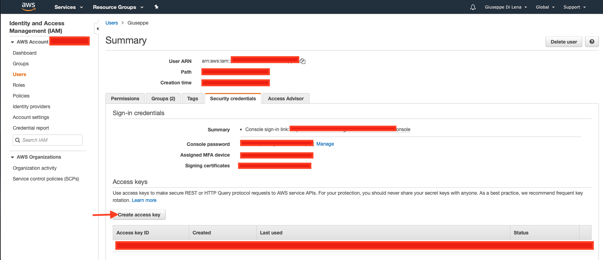
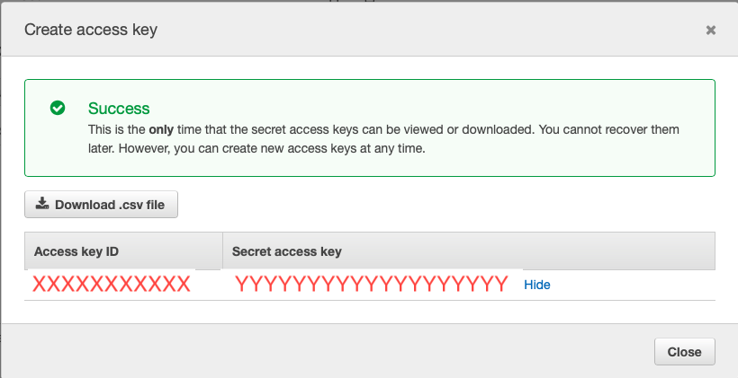
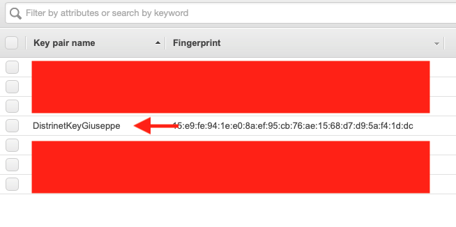

## Table of contents
{: .no_toc .text-delta }

1. TOC
{:toc}

# Prerequisites

In order to successfully install and run Distrinet on Amazon EC2, ensure your system meets the requirements described in this section.
Distrinet is compatible with python 3.6 or grater versions.

You need:
* an Amazon AWS account [link](https://aws.amazon.com/)

* git
```
sudo apt install git
```

* pip
```
sudo apt install python3-pip
```


* You need to put your AWS Credentials in ~/.aws/credentials.
You can create your aws_access_key_id and aws_secret_access_key from the [AWS Web interface](https://aws.amazon.com/)
```
mkdir ~/.aws
vim ~/.aws/credentials
```

File ~/.aws/credentials:
```
[default]
aws_access_key_id=XXXXXXXXXXXXXXXXX
aws_secret_access_key=YYYYYYYYYYYYYYYYYYYYYY
```

How to create aws_access_key_id and aws_secret_access_key via [AWS Web interface](https://aws.amazon.com/):

* Go to https://aws.amazon.com/ and log in


* Click on your username and go to "My security Credentials"


* On the left pannel click on "Users" and then click on your User(be sure that it has the right permissions)


* On Summary pannel Click on "Create access Key"


* Congratulation, you have a new Access Key ID and a Secret access key 


* you need to import you ssh public key in AWS

if you dont have a private and public key created in your system you can generate it with:
```
ssh-keygen
```

for this version you need to leave the default values like here:
```bat
root@53942a77d770:# ssh-keygen
Generating public/private rsa key pair.
Enter file in which to save the key (/root/.ssh/id_rsa):
Created directory '/root/.ssh'.
Enter passphrase (empty for no passphrase):
Enter same passphrase again:
Your identification has been saved in /root/.ssh/id_rsa.
Your public key has been saved in /root/.ssh/id_rsa.pub.
The key fingerprint is:
SHA256:zmU65OeCHb/zjBJQOTmSUW9vonTTsOdv9Sv6+VCUtoI root@53942a77d770
The key's randomart image is:
+---[RSA 2048]----+
|      .+.o       |
|      o *.      .|
|       o o+    + |
|      .  . =. o .|
|       .S BE=. o |
|       *o* *  o .|
|       oB+. .. ..|
|      . ++oo o+ .|
|         o+==++o.|
+----[SHA256]-----+
```

* cat your id_rsa.pub (make sure that the extension is .pub)
```
root@53942a77d770:/home/Distrinet# cat ~/.ssh/id_rsa.pub
ssh-rsa AAAAB3NzaC1yc2EAAAADAQABAAABAQCsLyI2hW/uoiLqcJEnAnYufUge1LhnBevdVy29tI1r93KFcQrspE2LwuwWhVxtC4QdhIIcZ1nfN5zTIWhOkIUXEc3oZcu/JEMix+ygJXoW53/6gKC/hPqZPT+d2ahyoXw+zYqOjBp3VjhHG32jfQE5oGhU3nSTVrdPj3BEnJJ0o4WHyLiwRxv5z2aATS7b0ziYU2f3Zwdf3s+zJ54Ois6/c6TtTGI0B8p2zr4CrsK5pCaUnlW0/sgOsS98wAP1NjxDxPUak2cr8ZbMA7TWLUXO11HAZaW2qgqxImsg90Wf4RQkX5GesmTglSl0W/t3Jg+3Q4idX4PgRzPl4GAMvJp7 root@53942a77d770
```

#### import  your id_rsa.pub in AWS:
* Go to https://aws.amazon.com/ and log in like before;


* Go on "Services" --> "EC2"


* Click on "Key pairs"


* "Import Key pair"


* Choose the name that you want, in my case I choosed "DistrinetKeyGiuseppe"(you need to use this name after) and paste your id_rsa.pub in Public key contents and Import it.


* You can seen now that your key has been added



## Prerequisite check
To check your system for prerequisites, enter the following commands:

# Installation

# Testing the installation
