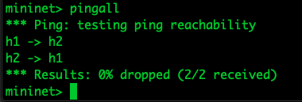

## Table of contents
{: .no_toc .text-delta }

1. TOC
{:toc}

# Prerequisites

In order to successfully install and run Distrinet, ensure your system meets the requirements described in this section.


# Installation
Distrinet requires one master and at least one worker.
Distrinet client should be abe to connect by ssh to the master and the master should be able to connect to the workers.
We are using ubuntu 18.04 for this tutorial.


1) Generate a ssh keypair in your Client (if you don't have one) and put the public id in ~/.ssh/authorized_keys file  of the master host and the worker hosts.

2) Generate a ssh keypair in your Master and put the public id in ~/.ssh/authorized_keys file of master host and the worker hosts.

3) Install ansible on your Master Host.
```
sudo apt install ansible -y
```

4) Configure ansible in your Master:
```
    1) vim /etc/ansible/hosts
    2) add the following lines
    
    [master]
    127.0.0.1 ansible_connection=local ansible_python_interpreter=/usr/bin/python3
    [workers]
    
    
    3) for each worker add the line
    
    WORKER_IP ansible_ssh_extra_args='-o StrictHostKeyChecking=no' ansible_python_interpreter=/usr/bin/python3
```
    
5) check your ansible configuration:

    ```
    ansible all -m ping
    
    you should receive an answer from all the hosts.
    ```
    
6) copy the file install-lxd.yml and configure-lxd-no-clustering.yml in your master

    
    scp ~/Distrinet/mininet/mininet/provision/playbooks/install-lxd.yml USER@MASTER_IP:
    scp ~/Distrinet/mininet/mininet/provision/playbooks/configure-lxd-no-clustering.yml USER@MASTER_IP:
    
    
7) connect to your Master host and run the playbooks with:

    
    ansible-playbook ~/install-lxd.yml
    ansible-playbook ~/configure-lxd-no-clustering.yml
    
    Depending on your connection and your machines, it can take around 5 or 10 minutes.
8) You can run an experiment from your distrinet client; be sure to set correctly the user the master and the workers when you run the experiment
The configuration file is at ~/.distrinet/conf.yml if you correctly installed distrinte in your client machine.
You have to configure the "ssh" and "cluster" part. If you don't need aws, g5k or port forwarding you can remove the from the file.

    1) ssh-->pub_id: you have to put your public key(the one that you use to connect to the master). 
    2) ssh-->user: the user that you use to connecto with the master and the slaves (it is better to use root.
    3) ssh-->client_keys: the path of the private key
    4) sss-->bastion: this is optional, is the default ip of your master host

After the configuration you can start your first experiment.
From your Distrinet client.
1) Go in your Distrinet home
    
    cd ~/Distrinet/mininet
    
2) Make sure to have the :mininet: in your PYTHONPATH:
    
    export PYTHONPATH=$PYTHONPATH:mininet:
    
3) run a simple experiment:
    
    python3 bin/dmn --bastion=MASTER_IP --workers="MASTER_IP,WORKER1_IP,WORKER2_IP" --controller=lxcremote,ip=192.168.0.1 --topo=linear,2
    
4) Connect in your master host.
    
    ssh USER@MASTER_IP

5) Once connected we can start ryu controller:
    
    ryu-manager /usr/lib/python2.7/dist-packages/ryu/app/simple_switch_13.py --verbose
    
6) After some seconds we are able to run pingall from mininet CLI.
    
 
7) Type "exit" to conclude the experiment.
